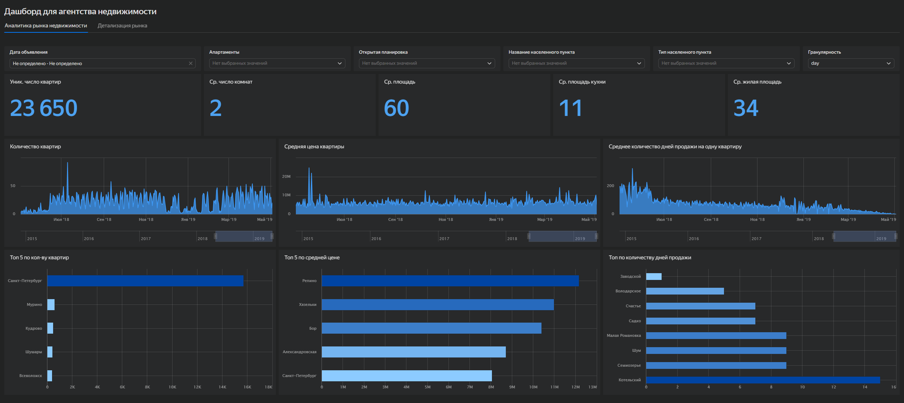

# Анализ рынка недвижимости (Санкт-Петербург и Ленинградская область)

## О проекте:

В проекте проведён анализ объявлений о продаже жилой недвижимости для агентства, планирующего выход на рынок Санкт-Петербурга и Ленинградской области.

Цель - определить наиболее перспективные сегменты рынка, понять скорость продажи объектов и выявить сезонные закономерности, чтобы помочь заказчику сформировать стратегию выхода на новый регион.

Анализ выполнен на данных сервиса Яндекс Недвижимость за 2015 - 2018 годы.

## Задачи:

* Оценить скорость продажи объектов недвижимости
* Сравнить рынок Санкт-Петербурга и Ленинградской области
* Выявить сезонные паттерны активности
* Определить характеристики объектов в разных сегментах
* Подготовить аналитическую основу для бизнес-решений

## Структура проекта:

Проект состоит из двух частей:

### 1. SQL-аналитика (`/SQL`)

Проведён анализ данных и расчёт ключевых метрик.

**Что было сделано:**

* Рассчитал длительность активности объявлений (days_exposition)
* Сегментировал объекты по скорости продажи
* Проанализировал характеристики недвижимости:

  * стоимость за м²
  * площадь
  * количество комнат и балконов
* Сравнил Санкт-Петербург и города Ленинградской области
* Проанализировал сезонность публикаций объявлений

Основные файлы:

* `Ad_activity_time.sql`
* `Seasonality_of_ads.sql`

### 2. Дашборд в DataLens (`/DataLens`)

Разработан и доработан интерактивный дашборд для анализа рынка недвижимости.

**Что реализовано:**

* Визуализация ключевых метрик:

  * средняя цена
  * количество объявлений
  * среднее время продажи
  * средняя площадь
* Анализ сезонности (месяцы × годы)
* Сравнение Санкт-Петербурга и Ленинградской области
* Выделение топ-5 населённых пунктов по скорости продаж
* Реализация фильтров для сегментации данных

## Превью дашборда:

## Стек:

* SQL - расчёт метрик и анализ данных
* Yandex DataLens - визуализация и построение дашборда

## Результат:

* Выявлены сегменты недвижимости с разной скоростью продажи
* Определены различия между рынком Санкт-Петербурга и области
* Найдены сезонные закономерности активности
* Разработан дашборд для анализа рынка и поддержки бизнес-решений
