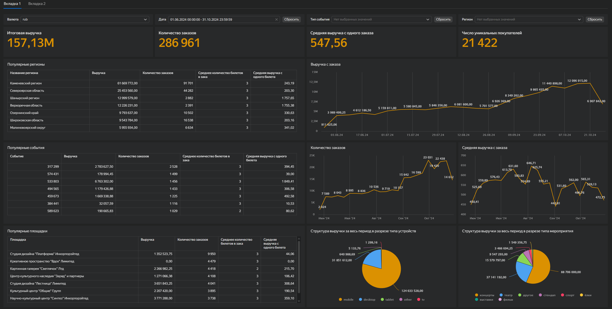
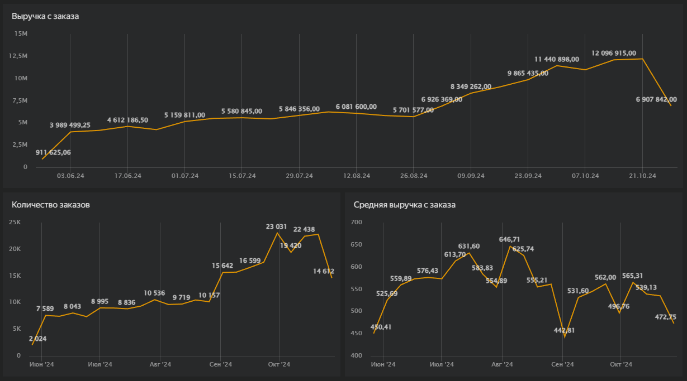

# Анализ данных сервиса Яндекс.Афиша

## О проекте

В проекте проведён комплексный анализ данных сервиса Яндекс.Афиша с целью выявить изменения в пользовательском поведении и динамике продаж в осенний период 2024 года.

Сервис позволяет пользователям находить мероприятия и покупать билеты, а партнёрам - размещать события и управлять продажами. В рамках анализа рассматривалась ситуация, когда продажи по разным категориям событий начали вести себя по-разному: часть растёт, часть - снижается.

Задача - понять причины этих изменений и подготовить аналитическую основу для принятия продуктовых решений перед сезоном распродаж и новогодних мероприятий.

## Цели исследования

* Проанализировать динамику ключевых бизнес-метрик (выручка, заказы, пользователи)
* Выявить изменения в популярности категорий событий
* Определить наиболее успешные события, площадки и организаторов
* Сравнить поведение пользователей на мобильных и десктопных устройствах
* Проверить гипотезы о различиях в пользовательской активности

## Структура проекта

Проект состоит из трёх частей:

### 1. SQL-аналитика (`/SQL`)

В рамках SQL-части проекта рассчитаны ключевые продуктовые метрики и подготовлены данные для дальнейшего анализа и визуализации.

Основные задачи:

* Рассчитал агрегированные показатели сервиса за весь период: выручка, количество заказов, уникальные пользователи и средний чек
* Проанализировал распределение выручки и количества заказов по типам устройств (mobile / desktop)
* Исследовал структуру выручки и заказов в разрезе типов мероприятий
* Построил недельную динамику ключевых метрик: выручка, заказы, уникальные пользователи и средний чек
* Выделил топ-7 регионов по объёму выручки

Результаты SQL-анализа использовались для построения дашборда и дальнейшего исследования в Python.

Основные файлы:

* `general_values_of_key_indicators.sql`
* `dynamics_of_value_changes.sql`
* `revenue_distribution_by_device.sql`
* `revenue_distribution_by_event.sql`
* `top_segments.sql`

### 2. Дашборд в DataLens (`/DataLens`)

Разработал интерактивный дашборд для мониторинга ключевых продуктовых метрик и анализа структуры выручки.

Основные задачи:

* Визуализировал динамику ключевых показателей: выручка, количество заказов, пользователи и средний чек
* Реализовал анализ структуры выручки по типам мероприятий
* Добавил сравнение пользовательского поведения по типам устройств (mobile / desktop)
* Вывел топ событий, площадок и организаторов по выручке
* Обеспечил удобную навигацию и возможность быстрого анализа ключевых метрик

Дашборд позволяет отслеживать изменения в продажах и быстро находить точки роста продукта.

Превью:

### 3. Исследовательский анализ (`/notebook`)

Проведён EDA и статистический анализ данных с использованием Python.

* анализ сезонности и пользовательской активности
* исследование распределений и ключевых метрик
* проверка гипотез о различиях между mobile и desktop пользователями
* формирование выводов и рекомендаций

Файл:

* `Проект Яндекс.Афиша.ipynb`

## Стек

* SQL - расчёт метрик и подготовка данных
* Python (`pandas`, `numpy`, `matplotlib`, `seaborn`, `scipy`) - анализ и проверка гипотез
* Yandex DataLens - визуализация и дашборд

## Результат

* Выявлены различия в динамике продаж по категориям событий
* Определены ключевые драйверы выручки
* Найдены различия в поведении пользователей по устройствам
* Подготовлены аналитические выводы, которые могут быть использованы продуктовой командой для оптимизации продаж и повышения вовлечённости
